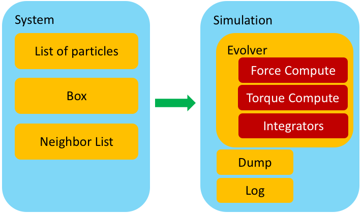

# Session 2

## Implementing a 2D simulation of Active Brownian Particles (ABP) in C++

In the second session of this tutorial we port the Python code developed in Session 1 to C++ and build a binding of the C++ to Python. We keep the structure and naming the same as in the Python version and only make changes where necessary to set the stage for the GPU implementation in Session 3.

### Brief overview of the design layout

The image below shows key components of a particle based simulation code and how they interact with each other: 

<div align="center">
    

</div>

Let us briefly focus on the *Evolver* class. Its task is to evolve the system by a single time step, i.e., to propagate the system in time for $\delta t$. In particular, its task is to:

1. Ensure that the neighbor list is up to date;
2. Perform the integration pre-step;
3. Compute all forces and torques on each particle;
4. Perform the integration post-step;
5. Apply periodic boundary conditions.

In our design, one can have multiple force and torque laws present in the system. In addition, multiple integrators can act in the same system. 


Here we focus on the item **3**, and, in particular, the fact that in a given system one could have multiple types of interactions. 

For example, in the case we studied in Session 1, we apply the self-propulsion force, $\mathbf{F}^\text{sp}_i = \alpha \mathbf{n}_i$ on each particle. In addition, each particle experiences soft-core repulsion due to overlaps with its neighbors, i.e., $\mathbf{F}_{i}^{\text{elastic}} = \sum_j k\left(2a - r_{ij}\right)\hat{\mathbf{r}}_{ij}$ for $r_{ij} \le 2a$, with the same meaning of parameters as used in Session 1. In our implementation, each term in the total force is implemented as a separate class. The self-propulsion term is handled by the *SelfPropulsion* class, while the soft-core repulsion is implemented in the *HarmonicForce* class.

The *Evolver* class has a member variable called *force_computes*, a Python list that stores all different types of interactions used in a given simulation. To be a bit more technical, if we want to add self-propulsion and soft-core repulsion to our system, we simply create two objects (instances), one for each of the two "force type" classes and append them to the *force_computes* list of the *Evolver* class. 

The *evolve* function of the *Evolver* class then **simply** iterates over all elements of the *force_computes* list and calls the appropriate *compute* function for each element.

It is not a coincidence that we put the word **simply** in bold. Due to Python's expressive and powerful data structure this was all we needed to do. However, a lot of things are happening under the hood here, which we need to understand if we are to switch to C++. Code written in C++ is in general much faster than the same code written in Python. This, however, comes at the expense that a lot of things that "just work" in Python, need to be explicitly implemented in C++.

In order to understand how to port to C++ the same functionality that allows us to split different types of forces into separate classes, we need to introduce the concepts of *class inheritance* and *smart pointers*.

### Classes

*Class* is the central language feature of C++. It is a user-defined type that represents a concept in the code. An instance of a class is called an *object*. A typical class is, therefore, a piece of C++ code that contains some data (called *member data*) and some operations that are performed on that data (called *member functions*). It also specifies how instances of the class are created (i.e., *constructed*) and how object intact with the environment.  In other words, a class is an abstraction of a set of properties and operations that can be performed on those properties. Note that a class can contain members only (i.e., no member functions) but it also can contain no member data and only member functions. At first, the later example sounds paradoxical but it is of central importance for this discussion.  

#### Concrete classes

Let us give several concrete examples of classes. 

One of the central entities in our simulation is a particle. It is, therefore, natural to represent it as a class. This is a very simple class that holds basic information such as position, velocity, type, etc. of a particle. 

```c++
struct Particle
{
    int id;           // particle id
    int type;         // particle type
    real radius;      // particle radius
    real2 r;          // particle position
    real2 v;          // particle velocity 
    real2 f;          // particle force
    real2 n;          // particle director
};
```


<div class="alert alert-block alert-info">
    <b>Note:</b> In the previous example, <i>real</i> and <i>real2</i> are user-defined types to be discussed later. We also use <i>struct</i> which is essentially a class with all members being <i>public</i>, i.e., accessible by non-member functions.  
   
Finally, our actual implementation includes several other member data, which are here omitted for brevity.
</div>

Arguably, *Particle* is not an overly exciting class as it does not do much. A more interesting example is the *System* class. This class hold the list of all particles and basic operations on them, such as adding a new particle. In a reduced form, this class could look something like this:

```c++
class System
{
public:
    
    System(Box& box) : _box{box}, _numparticles{0} { _particles.clear(); }
    ~System() { }
    std::vector<Particle>& get(void) { return _particles; }
    void add_particle(const Particle& _particle)
    {
        _particles.push_back(_particle);
        _particles[_numparticles].id = _numparticles;
        _numparticles = _particles.size();
    }
    int size() const { return _numparticles; }
    
private:
    
    Box& _box;                           // Simulation box
    std::vector<Particle> _particles;    // Standard library vector containing all particles
    int _numparticles;                   // Total number of particles in the system
    
    
};
```

<div class="alert alert-block alert-info">
Again, for future compatibility with the GPU our implementation is slightly different. 
</div>

Our *System* class is an example of a *concrete* class. It essentially behaves as any built-in type since it contains the data (e.g., a Standard Template Library vector of all particles) and some operations on that data (e.g., adding a new particle).

#### Abstract classes

What about forces though? We gave several examples of forces (e.g., self-propulsion and soft-core repulsion). These are all, however, specific examples of a force. The question is if there is a way to abstract the notion of a force and instead define an interface to all possible (within reason!) forces, some of which we may want to implement in the future?

The answer to that is provided by the concept of an *abstract class*. An abstract class is an *interface*, i.e., it is impossible to create an object that is an instance of an abstract class. However, it is possible to *inherit* from it and create a *class hierarchy* with *children* classes (ofter referred to as *derived classes*) that share the same interface as the *parent* class (often referred to as the *base class*) and provide a specific implementation. This allows us to create a robust system that can handle the entire class hierarchy and to add new functionality without having to make changes to the code that uses this class hierarchy. 

At this point, this all sounds rather convoluted. So, the best is to proceed with an example.

Let us create an abstract class called *Force* that will serve as the interface to all forces types (for simplicity, let us restrict to single-particle and pair-wise interactions).

```c++
class Force
{
public:
    
    Force(System& sys) : _sys{sys} { }
    virtual ~Force() { }
    std::string get_name() const { return _name; }
    virtual void compute() = 0;
    
protected:
    
    System& _sys;       // System object 
    std::string _name;  // Name of the interaction type (e.g., harmonic)
};
```

The *Force* class looks like any other class, with the exception of several important differences. The first one is that two of its member functions have a prefix **virtual**. This means that these functions will be overwritten by children classes and the precise version of the member function which is executed will be determined at the runtime. We will get back to this point shortly. 

In addition, we have this somewhat strange line

```c++
virtual void compute() = 0;
```

the "=0" notation means that the *compute* function is a *pure virtual function*, i.e., just a name holder. Any attempts to call *Force::compute()* will result in a compilation error. This just reflects the fact that one cannot simply compute *a force* without knowing what that force is. 

Finally, we note that the keyword **protected** means that those data members will be accessible by the children classes. 

#### Class inheritance 

Let us now implement a specific type of interaction, say, self-propulsion. We will do this by defining a class *SelfPropulsionForce* that is a child of the abstract class *Force*, i.e., class *SelfPropulsionForce* inherits the interface from the base class *Force*.

```c++
class SelfPropulsionForce : public Force
{
public:
    
    SelfPropulsionForce(System& sys, double alpha = 1.0) : Force{sys}, _alpha{alpha} { }
    ~SelfPropulsionForce() override { }
    void compute() override 
    {
        for(auto& p : _sys.get())
        {
           p.f += _alpha*p.n; 
        }
    }
    
private:

    double _alpha;   // strength of the self propulsion force
};

```

In the last example, line
```c++
class SelfPropulsionForce : public Force
```
means that the class *SelfPropulsionForce* is a *child* of the abstract class *Force*, i.e., it inherits its interface and some of its properties. The keyword **override** tells to C++ that this class "overrides", i.e., implements the actual computation of, in this case, self-propulsion force.

The power of building class hierarchies lies in how we can use the interface defined in the base class to access the children. 


Let us look into the relevant part of the *Evolver* class, i.e., the part that stores and computes all forces.

```c++
class Evolver
{
public:
    
    //..
    void add_force(const std::string name, std::unique_ptr<Force> f)
    {
        // ...
        _force_list[name] = std::move(f);   // Move is used here to transfer ownership of the unique_ptr f
        // ...
    }
    //...
    void compute_forces()
    {
        for (const auto& force : _force_list)
            force.second->compute();
    }
    // ...
    
private:
    
    std::map<std::string, std::unique_ptr<Force>> _force_list;    // list of all the pointer to the forces
    
};
```

Let us analyze this example. First we note the line
```c++
std::map<std::string, std::unique_ptr<Force>> _force_list;
```
which tells the *Evolver* class to store all force types into a map (i.e., loosely speaking, a C++ version of Python's dictionary) where keys are strings (i.e., the name of the force, such as 'self-propulsion') and the value is a **unique pointer** to the *Force* object.

<div class="alert alert-block alert-info">
 <b>Reminder:</b> A pointer is a variable that stores the address of another variable (e.g., an object). A raw pointer is dereferenced (i.e., the content of the memory location it points to is accessed) using the '*' operator. However, when working with *raw* pointers the programmer has to ensure that the memory is released back to the OS once the pointer goes out of scope. Otherwise, one can end up with, often hard to track, memory leaks.   
</div>

There are two important points in here. A *unique pointer* is a version of a *smart pointer*. A *smart pointer* is a close cousin of the raw pointer with an important difference that it automatically disposes of the object it points to when it goes out of scope. A *unique pointer* is a special type of a smart pointer such that there can be only one copy of it.

The second important point is that we defined a unique pointer to the abstract class *Force*, i.e., this class will serve as the interface to all of its children. Precisely because of this 'place-holder' role we have to use pointers instead of bare types. In other words, a definition such as 
```c++
std::map<std::string, Force> _force_list;
```
would not work, since it is impossible to create object of the abstract type *Force*.

In the main code, we would have a sequence like
```c++
{
    // ...
    Evolver e(/* ... */);
    e.add_force("self-propulsion", std::unique_ptr<SelfPropulsionForce>(new SelfPropulsionForce(2.0)));
    // ...
    e.compute_forces();
    // ...
}
```

Note an important thing here, although the member function 
```c++
void add_force(const std::string name, std::unique_ptr<Force> f)
```
of the *Evolver* class expects 
```c++
std::unique_ptr<Force>
``` 
as it second parameter, in the line
```c++
e.add_force("self-propulsion", std::unique_ptr<SelfPropulsionForce>(new SelfPropulsionForce(2.0)));
``` 
we passed a unique pointer to the *SelfPropulsionForce* class instead. While this looks like a mistake, it is actually intended behavior, since the class *Force* acts as the interface to all implementations of force classes. Since we pass a pointer and not the actual object, the precise implementation of the virtual member functions can be decided at the runtime. Therefore, in this case, Evolver's *compute_force* class will call the *compute* member function defined in the *SelfPropulsionForce* class. 

This mechani where we can use a base abstract type to refer to a wide range of *derived* (i.e., children) types is called *polymorphism* and is one of the central features of all modern object oriented languages. 

Its power lies in the fact that if in the future we decide to implement, say, a *LennardJonesForce* class we do not need to modify the *Evolve* class at all. Instead, all we need to do would be write 
```c++
{
    // ...
    e.add_force("lennard-jones", std::unique_ptr<JennardJonesForce>(new LennardJonesForce(2.0, 1.0)));
    // ...
    e.compute_forces();
    // ...
}
```
in the main code. 

## Binding C++ and Python

In this section we briefly describe how to bind c++/CUDA with Python. For that propose we are going to use header-only library ([pybind11](https://github.com/pybind/pybind11)), that exposes C++ data structures to Python.  

### Brief overview of the design layout: *the interface*

The following image shows the key points on how to build a Python interface to our C++ simulation package. 

<div align="center">
    

</div>
<div class="alert alert-block alert-warning">
    <b>Note:</b> This is one of many design layouts that can be used. The one chosen here reflects our design philosophy of minimizing the interdependence of different components of the code. In addition, it naturally fits with the aim to use Python as the scripting language for controlling the simulation and therefore isolating the C++/CUDA implementation .</div>

### The interface: pybind11

[**pybind11**](https://pybind11.readthedocs.io/en/stable/intro.html) is a lightweight header-only library that provide a fast development interface to create Python bindings to existing C++ code. Here we supply a brief description of how to build a Python interface to our C++ ABP code.

**pybind11** library has an excellent documentation, so for brevity here we are only focus in how to expose classes and functions. Let us give several concrete examples of how to expose C++ code to Python. 

### 1. Exposing functions

Consider the following C++ function that applies periodic boundary conditions.
```c++
///<! @file: enforce_periodic.hpp

inline double enforce_periodic(const double &r, const double &L, const bool& periodic)
{
    double _r = r;
    if (periodic)
    {
        if (_r > 0.5*L)
            _r -= L;
        else if (_r < -0.5*L)
            _r += L;
    }
    return _r;
}
```

Now, to expose **``double enforce_periodic(const double &r, const BoxType &box)``**  to Python we need a **```.cpp```** file with the following additional lines of **pybind11** code:

```c++  
///<! @file: python_bindings_export.cpp
#include <pybind11/pybind11.h>    ///<!Include the pybind11 library 
#include "enforce_periodic.hpp"   ///<!Include enforce_periodic.hpp

PYBIND11_MODULE(cppmodule, m) 
{
    m.doc() = "pybind11 example";  ///<! optional module docstring
    m.def("enforce_periodic", &enforce_periodic, "Enforce periodic boundary conditions");
}
```
The **``PYBIND11_MODULE()``** macro creates a function that can be called from within Python. The first argument in **``PYBIND11_MODULE()``** is the *module name* (**cppmodule**,  in our case, whereas the second macro **``m``** defines a variable of type **``py::module``** which is the main interface for creating bindings. Next, **``module::def()``** keyword generates binding code that exposes the **``enforce_periodic()``** function to Python. Now from the Python side we can simply write

```python
from cppmodule import * 

L = 10.0
x = 11.0
#New x 
x_periodic = enforce_periodic(x, L, True)

```

### 2. Exposing structured types

Structured types are classes that contain *only* encapsulated data types such our **``struct Particle``** :


```c++
///<! @file: particle.hpp

/* @brief 1D particle type */
struct Particle
{
    int id;           // particle id
    int type;         // particle type
    real radius;      // particle radius
    real r;           // particle position
    real v;           // particle velocity 
    real f;           // particle force
    real n;           // particle director
};
```

The following code shows how to expose such a structure to Python. Before we do this, we need to understand how to expose **``classes``** with pybind11.

```c++
///<! @file: pybind_export_particle.hpp

#include "particle.hpp"

void export_ParticleType(py::module &m)
{
    py::class_<Particle>(m, "Particle")
        .def(py::init<>())
        .def_readwrite("id", &Particle::id, "Particle id")
        .def_readwrite("type",  &Particle::type, "Particle material type")
        .def_readwrite("radius", &Particle::radius, "Particle radius")
        .def_readwrite("r", &Particle::r, "Particle positions")
        .def_readonly("v", &Particle::v, "Particle velocity")
        .def_readonly("f", &Particle::f, "Particle force");
        .def_readwrite("n", &Particle::n, "Particle director");
}
```

Here the **``class_``** creates bindings for a C++ class or struct-style data structure, and as Python classes. The  **``init()``** takes the types of a constructor’s parameters as template arguments and wraps the corresponding class constructor. In our case **``struct Particle``** doesn't define any constructor inside of C++ code but by using pybind it is possible to extend this without modifying the ``particle.hpp`` file

```c++
///<! @file: pybind_export_particle.hpp

//..
{
    py::class_<Particle>(m, "Particle")
        .def(py::init<>())  ///<!default constructor
        .def("__init__", [](Particle &self, const int& id, const int& type, const real& radius, const real& r, const real& n) ///<! pybind constructor
             {
                    new (&self) Particle();
                    self. = x;
                    self.y = y;
                    self.id = id;              // particle id
                    self.type = type;          // particle type
                    self.radius = radius;      // particle radius
                    self.r = r;                // particle position
                    self.n = n                 // particle director
                    self.v = 0.0               // particle velocity
                    self.f = 0.0               // particle force
                })
        //..
}
```

Finally we need to **``export``** the **``Particle``**  type as follows

```c++  
///<! @file: python_bindings_export.cpp
#include <pybind11/pybind11.h>           ///<!Include the pybind11 library 
#include "enforce_periodic.hpp"          ///<!Include enforce_periodic.hpp
#include "pybind_export_particle.hpp"    ///<!Include pybind_export_particle.hpp

PYBIND11_MODULE(cppmodule, m) 
{
    m.doc() = "pybind11 cppmodule";                                                       ///<! optional module docstring
    m.def("enforce_periodic", &enforce_periodic, "Enforce periodic boundary conditions"); ///<! export enforce periodic function
    export_ParticleType(m);                                                               ///<! export Particle type
}
```
Now from the Python side we simply write

```python
from cppmodule import * 

p = Particle() # define an empty particle
p.id = 0
p.type = 0
p.radius = 1.0
p.x = 0.35
p.n = -1.0
p.f = -1.2 # Error read only variable!
# and so on .. 
# or simple
p = Particle(0, 0, 1.0, 0.35, 1)
```

### 3. Export any type of class. 

To export a full C++ class containing both member data and member functions, we need to simply follows the steps **1** and **2** taking in account the following

<div class="alert alert-block alert-info">
 <b>Pybind in short</b> 
 
| Type        | pybind interface           |   
| :------------- |-------------:|
| function      | ``.def("myfunction", &myfunction)`` |  
| class       | ``py::class_<myclass>(py::module, "myclass"))`` |  
| class constructor I    | ``.def(py::init<var1, ..., varN>()))`` |  
| class constructor II      | ``.def("__init__", [](myclass &self, var1, ...,varN))`` |  
| class *read only* variable      | ``.def_readonly("myvariable", &myclass::myvariable)`` |  
| class read and write variable      | ``.def_readwrite("myvariable", &myclass::myvariable)`` | 
| class function      | ``.def("myfunction", &myclass::myfunction)`` |  

 <b>For more information visit <a href=https://pybind11.readthedocs.io/en/stable/intro.html>pybind documentation page</a>!!
</b> </div>
 
As an example consider the SystemClass defined in **``ABPTutorial/c++/cppmd/md/system.hpp``**, 

```c++  
void export_SytemClass(py::module &m)
{
    py::class_<SystemClass>(m, "System")
        .def(py::init<const BoxType &>())
        .def(py::init<const host::vector<ParticleType> &, const BoxType &>())
        .def("get_particles", &SystemClass::get)
        .def("add", &SystemClass::add_particle)
        .def("apply_periodic", &SystemClass::apply_periodic)
        .def("box", &SystemClass::get_box)
        .def_readonly("Numparticles", &SystemClass::Numparticles)
        ;
}
```

## Working Example

Now that we have all key ingredients in place, we can proceed to test our C++ simulation and its Python interface. Before we do this, let us briefly recapitulate the key steps in performing any particle-based simulation.

### Review on particle-based simulation

Our simulation workflow consists of three steps:

1. Creating the initial configuration; 
2. Executing the simulation; 
3. Analyzing the results.

Where, the step 1 feeds into step 2, which, in turn feeds into step 3. The step 1 generate the system configuration for our simulation as a single JSON file (see **``Python/pymd/builder``** or **``ABPTutorial/c++/cppmd/builder``**).

<div class="alert alert-block alert-warning">
    <b>Reminder:</b>    
To generate configurations we need to do the following. 

```python
from cppmd.builder import *
phi = 0.4
L = 50
a = 1.0
random_init(phi, L, rcut=a, outfile='init.json') 
    
```

    
Where, $\phi$ is the number density, $L$ is the box's size, and $a$ the particle radius. 
</div>


Let us start with a working example of a full simulation. 

We read the initial configuration stored in the file *init.json* with $N=4,000$ randomly placed particles in a square box of size $L=100$. We assume that all particles have the same radius $a=1$. Further, each particle is self-propelled with the active force of magnitude $\alpha=1$ and experiences translational friction with friction coefficient $\gamma_t = 1$. Rotational friction is set to $\gamma_r = 1$ and the rotational diffusion constant to $D_r = 0.1$. Particles within the distance $d=2$ of each other experience the polar alignment torque of magnitude $J=1$.

We use the time step $\delta t = 0.01$ and run the simulation for $1,000$ time steps. We record a snapshot of the simulation once every 10 time steps.


```python
%matplotlib widget
import cppmd as md

#particles, box = md.read_json("initphi=0.4L=50.json") #here we read the json file in python
#system = md.System(particles, box)

reader = md.fast_read_json("initphi=0.4L=50.json")  #here we read the json file in c++
system = md.System(reader.particles, reader.box)

dump = md.Dump(system)          # Create a dump object
print("t=0")
dump.show()                     # Plot the particles with matplotlib

evolver = md.Evolver(system)    # Create a system evolver object

#add the forces and torques

# Create pairwise repulsive interactions with the spring contant k = 10 and range a = 2.0
evolver.add_force("Harmonic Force", {"k": 10.0, "a": 2.0})

# Create self-propulsion, self-propulsion strength alpha = 1.0
evolver.add_force("Self Propulsion", {"alpha": 1.0})

# Create pairwise polar alignment with alignment strength J = 1.0 and range a = 2.0
evolver.add_torque("Polar Align", {"k": 1.0, "a": 2.0})

#add integrators
# Integrator for updating particle position, friction gamma = 1.0 , "random seed" seed = 10203 and no thermal noise
evolver.add_integrator("Brownian Positions", {"T": 0.0, "gamma": 1.0, "seed": 10203})

# Integrator for updating particle orientation, friction gamma = 1.0, "rotation" T = 0.1, D_r = 0.0, "random seed" seed = 10203
evolver.add_integrator("Brownian Rotation", {"T": 0.1, "gamma": 1.0, "seed": 10203})

evolver.set_time_step(1e-2) # Set the time step for all the integrators

```

    t=0


    Canvas(toolbar=Toolbar(toolitems=[('Home', 'Reset original view', 'home', 'home'), ('Back', 'Back to previous …


```python
for t in range(1000):
    #print("Time step : ", t)
    evolver.evolve()    # Evolve the system by one time step
    if t % 10 == 0:     # Produce snapshot of the simulation once every 10 time steps
        dump.dump_vtp('test_{:05d}.vtp'.format(t))
```


```python
print("t=1000")
dump.show()                     # Plot the particles with matplotlib
```

    t=1000


    Canvas(toolbar=Toolbar(toolitems=[('Home', 'Reset original view', 'home', 'home'), ('Back', 'Back to previous …


## Visualizing results

As before, we have saved our output files using the VTP format. For convenience, here we also provide a Paraview state file, which will allow us to rapidly plot the results. 

### Instructions:

1. Open **``paraview``**.
2. Go to **``File->Load State->paraview_plotter.py``**

If you desire to change the names of the output file or the number/snapshoot steps, you will need to modify the following lines in **``paraview_plotter.py``**.

```python
#@file paraview_plotter.py
#...
t0 = 0                       #minimum time step
tf = 1000                    #maximum time step
step = 10                    #snapshot every step  
folder = 'your_source_folder'#the source folder  
file_name_prefix = 'prefix_' #in our case test_
filenames_vec = [folder+file_name_prefix+'{:05d}.vtp'.format(t) for t in range(t0, tf, step)]
print(filenames_vec)
#...

```
