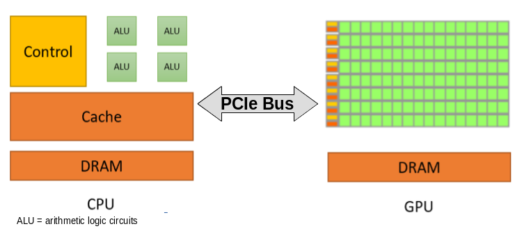
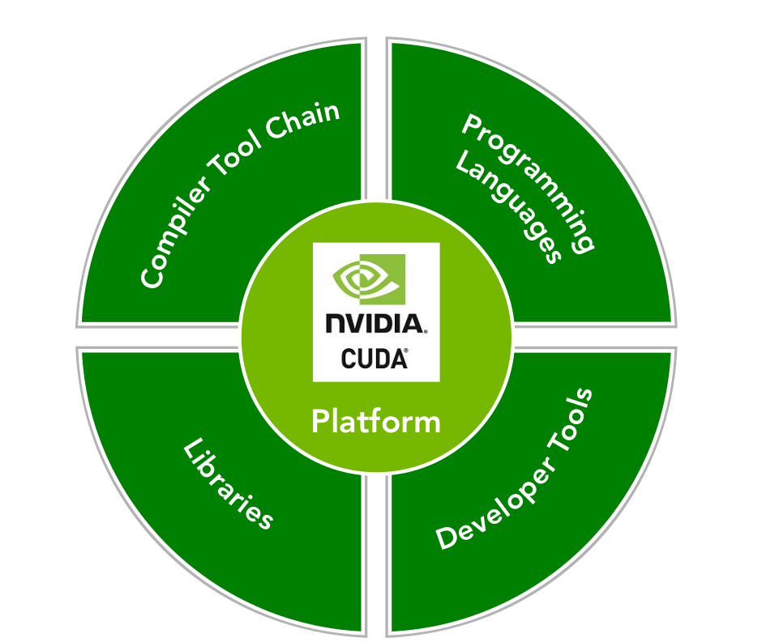
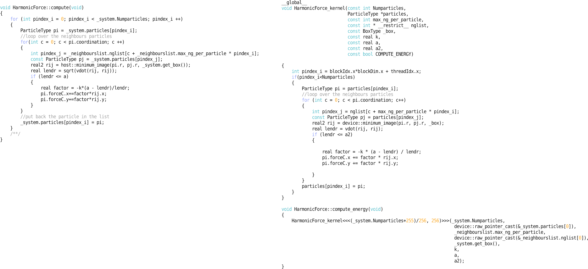

# Session 3

## Implementing a 2D simulation of Active Brownian Particles (ABP) in GPUs

In the second session of this tutorial, we port the C++ and the Python codes developed in Sessions 1 and 2 to modern Graphics Processing Units (GPUs). We keep the structure and naming the same as in the C++ version and only make changes where necessary. We are going to focus on how to implement the **force** and **integrator** algorithms in parallel keeping the rest of the code intact.

The figure below outlines the general layout of the simulation package we are developing.

&emsp;

<div align="center">

</div>

## Parallel computing: A brief introduction

Before we dive into the details of the GPU implementation of our simulation, let us briefly overview the basic ideas behind parallel computing, in particular focusing on the use of modern GPUs.

From a practical point of view, parallel computing can be defined as a form of computation in which many calculations are executed simultaneously. Large problems can often be divided into smaller ones, which are then solved concurrently on different computing resources. 

# Sequential vs Parallel

As we've seen in the previous tutorials, a computer program consist of a series of operations that performs a specified task. For example, our ``evolve`` step in the ``Evolver`` class needs to perform **sequentially** the following calculations:

1. *Check if neighbor list needs rebuilding*
2. *Perform the pre-integration step, i.e., step before forces and torques are computed*
3. *Apply periodic boundary conditions*
4. *Reset all forces and toques*
5. *Compute all forces and torques*
6. *Perform the second step of integration*
7. *Apply period boundary conditions*

In general, one can classify the relationship between two pieces of computation as those that are: <br>

**(a)** *related by a precedence restraint* and, therefore, must be calculated sequentially, such as the ``evolve`` step, and <br>
**(b)** *not related by a precedence restraints* and, therefore, can be calculated concurrently. Any program containing tasks that are performed concurrently is a **parallel program**. 

## Parallelism

There are two fundamental types of parallelism:

* *Data parallelism*: when there are many data items that can be operated *on* at the same time.
* *Task parallelism*: when there are many tasks that can be operated independently and largely in parallel.

<div align="center">


<center>(Left) Data parallelism focuses on distributing the data across multiple computational units (e.g., CPU cores). (Right) Task parallelism focuses on distributing functions across multiple cores.</center>
</div>

&emsp;

In this final session of this tutorial, we are going to focus on Graphics Processing Units or GPUs, which are especially well-suited to solve problems that can be expressed as data-parallel computations.

## GPUs computing: Heterogeneous Architecture

Nowadays, a high-end workstation or a typical compute node in a high-performance computer cluster contains several multi-core central processing unit (**CPU**) sockets and one or more GPUs. The GPU acts a co-processor to a CPU operating through a **PCI-Express BUS**. GPUs are designed to fulfill specialized task, in particular, for producing high-resolution graphics in real time. A modern GPU consists of several thousands compute cores.

<div align="center">

</div>


In terms of its purpose, a CPU core is designed to optimize the execution of sequential programs. In contrast, a GPU core (much simpler in design than a CPU code) is optimized for data-parallel tasks focusing on the large throughput. Since the GPUs function as a "co-processor", the CPU is called the ``host`` and the GPU is called the ``device``.

Because of this ``host-device`` relationship, any GPU-based application consist of two parts:

* Host code
* Device code

As the name suggests, the *host code* is executed on the CPU, while the *device code* runs on GPUs. Typically, the CPU is in charge of initialize the environment for the GPU, i.e, allocating memory, copying the data, etc. 

## The CUDA platform 

[**CUDA**](https://developer.nvidia.com/cuda-zone) is a parallel computing platform and programming model that makes use of the parallel compute engine of [NVIDIA GPUs](https://www.nvidia.com/en-us/shop/). From the practical point of view, CUDA provides a programming language interface for C, C++, Fortran, openCL programming languages. 

<div align="center">

</div>

### The CUDA Programming Model

Here we are going to briefly overview how to write CUDA-C/C++ code that makes use of the GPU. As stated above, our application consist in two "types" of code. The first is the ``host`` code and the second is the ``device`` code. The device code (which is exclusively executed on the GPU) is denominated **``kernel``**. The kernels function are identified by the keyword ``__global__``, and by the fact that **never** return any value (i.e., they always have the ``void`` return type). The following example shows a simple ``Hello, world!`` program:

```c
//@file: hello_world.cu
#include "hello_world.hpp"

// device code start
__global__ void hello_world_kernel()
{
    printf("hello");
}
// device code end

// host code start
void call_hello_world_kernel(void)
{
    hello_kernel<<<1,1>>>();
}
// host code end

//@file: hello_world.hpp
void call_hello_world_kernel(void); //forward declaration

//@file: main.cpp
#include "hello_world.hpp"

// host code start
int main()
{
    ///...

    call_hello_world_kernel();
    
    ///...
}
// host code end

```
Kernels codes have several properties: 
1. are identified by the ``__global__`` qualifier with ``void`` return type;
2. are only executable on the device;
3. are only callable by the host.

#### Where is the parallelism here?

So far we haven't seen any parallelism. Before we can do this, we need to understand two fundamental concepts in the CUDA-verse:

1. Thread abstraction and organization;
2. Memory hierarchy.

<div align="center">

</div>

#### 1. Thread abstraction and organization

Kernels need to be configured to be run on the device. In the previous code, the triple chevrons``<<<X, Y>>>`` represents the execution configuration, that dictates how many device threads execute the kernel in parallel. A thread of execution is the smallest sequence of programmed instructions that can be managed independently. In CUDA, all threads essentially execute the same piece of code: *thread abstraction*. 

A single invoked kernel is referred to as a **grid**. A grid is comprised of **thread blocks**. A **block** is comprised of multiple **threads**.  In the CUDA programming model, we speak of launching a kernel with a grid of **thread of blocks**. The first argument in the execution configuration (``<<<X, Y>>>``) specifies the number of thread blocks in the grid, and the second specifies the number of threads in a thread block. 

```c
//@file: hello_world.cu
#include "hello_world.hpp"

// device code start
__global__ void hello_world_kernel()
{
    printf("hello"); 
}
// device code end

// host code start
void call_hello_world_kernel(void)
{
    uint thread_of_blocks = 4;
    uint threads_in_block = 8;

    hello_kernel<<<thread_of_blocks,threads_in_block>>>();
    //here hello will be printed $thread_of_blocks \times threads_in_block = 32$
}
// host code end
```

Example:

<div align="center">

</div>

<div class="alert alert-block alert-warning">
    <b>Note:</b> A CUDA execution grid is organized as a 2D array of blocks, and a block is organized as a
3D array of threads, and a block is organized as a 3D array of threads. Grids and blocks use the dim3 type with three unsigned integer types. Unused fields are initialized to 1 and ignored.</div>

#### 2. Memory hierarchy

CUDA programming model expose on-chip memory hierarchy allowing the user to make an efficient use of the resources to speed up applications. In general the memory can be *programmable* and *non-programmable*. L1 cache and L2 cache in the CPU memory space, are examples of non-programmable memory. On the other hand, the CUDA memory model exposes many types of programmable memory: ``Registers``, ``Shared memory``, ``Local memory``, ``Constant memory``, ``Texture memory``, and ``Global memory`` (see figure above). In this tutorial, we are going to cover some aspects of the ``Global memory`` and the ``Constant memory``.

* **Global memory** Is the largest, highest-latency, and most commonly used memory on a GPU. Its state can be accessed from the device throughout the lifetime of the application. A variable in global memory can either be allocated statically or dynamically. 

* **Constant memory** As the name may indicate, we use constant memory for data that will not change over the course of a kernel execution.

```c
//@file: hello_world.hpp

// Global memory statically in device code using the qualifier __device__
__device__ int my_static_variable = 2;

// Constant memory statically in device code using the qualifier __constant__
__constant__ int my_const_static_variable = -1;


void call_hello_world_sum_kernel(void); //forward declaration

//@file: hello_world.cu
#include "hello_world.hpp"

// device code start
__global__ void hello_world_sum_kernel(__constant__ int Num, int* vector_of_int_dev)
{
    int i = blockIdx.x*blockDim.x + threadIdx.x;
    //For cases where the number of elements in the arrays is not evenly divisible by the thread block size
    //the kernel code must check for out-of-bounds memory accesses    
    if(i<Num)
    {
        vector_of_int_dev[i] = i*my_static_variable + my_const_static_variable;
    }
    //..
}

// host code start
void call_hello_world_sum_kernel(const unsigned int Num = 100)
{
    ///dynamically 
    unsigned int nbytes = Num * sizeof(int);
    
    // allocate the host memory
    int *vector_of_int_host = (int *)malloc(nbytes);
    
    // allocate the device vector
    int *vector_of_int_dev;
    cudaMalloc((float **)&vector_of_int, nbytes);
    
    // initialize the host vector
    for(unsigned int i=0;i<Num;i++) vector_of_int_host[i] = 0;
    
    // transfer data from the host to the device
    cudaMemcpy(vector_of_int_host, vector_of_int_dev, nbytes, cudaMemcpyHostToDevice);    
    
    //Do something with the vector_of_int_dev
    do_something<<<(Num+255)/256, 256>>>(vector_of_int_dev);
    
    
    // transfer data from the device to the host
    cudaMemcpy(vector_of_int_host, vector_of_int_dev, nbytes, cudaMemcpyDeviceToHost);
    
    // free memory
    cudaFree(vector_of_int_dev);
    free(vector_of_int_host);
    
}
// host code end

```

#### CUDA Libraries: Thrust

As in C/C++, native CUDA libraries provide collection of function definitions whose signatures are exposed through header files. The CUDA libraries are special in that all computation implemented in the library is accelerated using a GPU. 

<div align="center">

</div>

In the provided code, we have made a full use of thrust as a replacement for *Standard Template Library (STL)* library. Thrust is a C++ template library for CUDA based on the STL that allows to implement high performance parallel applications with minimal programming effort through a high-level interface. For example, in our previous example we ``manually`` allocate memory on the *device* by calling ``cudaMalloc (void **devPtr, size_t size)`` then we copy the *host* data to the *device* by using ``cudaMemcpy( void * dst, const void *src, size_t count, enum cudaMemcpyKind  kind )``, and finally at the end of the execution we free the memory by calling ``cudaFree(devPtr)``. Using Thrust we need to simply do:

```c++
#include <vector> //stl vector
#include <thrust/device_vector.h> //thrust vector
#include <thrust/copy.h>          //thrust copy

{
    //...
    //allocate & initialize the host vector
    std::vector<int> vector_of_int_host{Num, 0};
    
    //allocate & copy the device vector
    thrust::device_vector<int> vector_of_int_dev = vector_of_int_host;
    
    //or we can simple do
    thrust::device_vector<int> vector_of_int_dev{Num, 0};

    //Do something with the vector_of_int_dev
    do_something<<<(Num+255)/256, 256>>>(device::raw_pointer_cast(&vector_of_int_dev[0]));
    
    //device::raw_pointer_cast creates a "raw" pointer from a pointer-like type, simply returning the wrapped pointer 
    // pretty much like *vector_of_int_dev
    
    // stl like copy to vector_of_int_host
    thrust::copy(vector_of_int_dev.begin(), vector_of_int_dev.end(), vector_of_int_host.begin());
    
    //DONE! We don't need to free memory since is managed by thrust
}
```

For more information please check ``~/cuda/gpumd/md/src/types/devicevector.hpp``**

# Real world example: The harmonic force calculation

<div align="center">

</div>

By now, we should all be familiar with the ``cppmd`` package developed in the Session 2. Let's take a closer look into what have changed when switching to GPUs:

1. the ``std::vector<T>`` were replaced by ``thrust::device_vector<T>``.
2. there is a kernel function ``void HarmonicForce_kernel(...)`` that calculate the forces for each particle in parallel by replacing the for loop on the right (3).
3. for loop is now replaced by:
```c++
{
    int pindex_i = blockIdx.x*blockDim.x + threadIdx.x;
    if(pindex_i<Numparticles)
    {
        ///...
    }
}
```

That's all! The rest of the code remains unchanged!


## Conclusion

The code presented here is not highly optimized for run in GPUs. For example, the ``HarmonicForce_kernel`` have several irregular access pattern where different threads **read** the same memory bank, i.e., each particle have more than one neighbor and those neighbor need the particle *j* information for calculating the force producing *serialization* during reading. To fix this one should make use **Memory hierarchy** (``shared`` memory would do the trick in this case!) which is out of scope on this tutorial. 

One of the drawbacks of parallel computation is that hardware and software deployment are deeply intertwined. This mean that to optimize the code we first need to have a deep understanding of how hardware operate at least at the basic level, like in **Memory hierarchy** case. Nevertheless, even with the basic parallel application implementation we can gain significant speed-ups.

### Code optimization

Follow common sense! Let's say that a given application is 5x faster compared to the serial code and after "deep" optimization that makes the code "harder" to maintain you only gain 7x respect the serial code, then is not worthy. 

#### Assess, Parallelize, Optimize, Deploy (APOD)

APOD is a cyclical process: initial speedups can be achieved, tested, and deployed with only minimal initial investment of time, at which point the cycle can begin again by identifying further optimization opportunities, seeing additional speedups, and then deploying the even faster versions of the application into production.

<div align="center">

</div>


## Working Example

Now that we have all key ingredients in place, we can proceed to test our CUDA simulation and its Python interface. Before we do this, let us briefly recapitulate the key steps in performing any particle-based simulation.

### Review on particle-based simulation

Our simulation workflow consists of three steps:

1. Creating the initial configuration; 
2. Executing the simulation; 
3. Analyzing the results.

Let us start with a working example of a full simulation. 

We read the initial configuration stored in the file *init.json* with $N=36,000$ randomly placed particles in a square box of size $L=300$. We assume that all particles have the same radius $a=1$. Further, each particle is self-propelled with the active force of magnitude $\alpha=1$ and experiences translational friction with friction coefficient $\gamma_t = 1$. Rotational friction is set to $\gamma_r = 1$ and the rotational diffusion constant to $D_r = 0.1$. Particles within the distance $d=2$ of each other experience the polar alignment torque of magnitude $J=1$.

We use the time step $\delta t = 0.01$ and run the simulation for $1,000$ time steps. We record a snapshot of the simulation once every 10 time steps.


```python
%matplotlib widget
import gpumd as md

json_reader = md.fast_read_json("initphi=0.4L=300.json") #here we read the json file in python
system = md.System(json_reader.particles, json_reader.box)

dump = md.Dump(system)          # Create a dump object
print("t=0")
#dump.show(notebook=True)        # Plot the particles with matplotlib

evolver = md.Evolver(system)    # Create a system evolver object

#add the forces and torques

# Create pairwise repulsive interactions with the spring contant k = 10 and range a = 2.0
evolver.add_force("Harmonic Force", {"k": 10.0, "a": 2.0})

# Create self-propulsion, self-propulsion strength alpha = 1.0
evolver.add_force("Self Propulsion", {"alpha": 1.0})

# Create pairwise polar alignment with alignment strength J = 1.0 and range a = 2.0
evolver.add_torque("Polar Align", {"k": 1.0, "a": 2.0})

#add integrators
# Integrator for updating particle position, friction gamma = 1.0 , "random seed" seed = 10203 and no thermal noise
evolver.add_integrator("Brownian Positions", {"T": 0.0, "gamma": 1.0, "seed": 10203})

# Integrator for updating particle orientation, friction gamma = 1.0, "rotation" T = 0.1, D_r = 0.0, "random seed" seed = 10203
evolver.add_integrator("Brownian Rotation", {"T": 0.1, "gamma": 1.0, "seed": 10203})

evolver.set_time_step(1e-2) # Set the time step for all the integrators
```

    t=0


<div align="center">

</div>


```python
for t in range(10000):
    #print("Time step : ", t)
    evolver.evolve()    # Evolve the system by one time step
    #if t % 10 == 0:     # Produce snapshot of the simulation once every 10 time steps
    #    dump.dump_vtp('test_{:05d}.vtp'.format(t))
print("t=10000")
#dump.show(notebook=True)              # Plot the particles with matplotlib    
```

    t=10000


<div align="center">

</div>

<div align="center">

</div>

# Speed up comparison

Now let's see how the ``GPU`` code compare with the previous session.

<div align="center">

</div>

As you can see, even the first round on the **Assess, Parallelize, Optimize, Deploy** give us 2435x times faster than the ``Python`` code, and 9.3x times than the ``c++`` code.

## References
* [https://devblogs.nvidia.com/](https://devblogs.nvidia.com/)
* [https://docs.nvidia.com/cuda/cuda-c-programming-guide](https://docs.nvidia.com/cuda/cuda-c-programming-guide/index.html)
* [https://docs.nvidia.com/cuda/cuda-c-best-practices-guide](https://docs.nvidia.com/cuda/cuda-c-best-practices-guide/index.html)
* Cheng, John, Max Grossman, and Ty McKercher. Professional CUDA c programming. John Wiley & Sons, 2014.
* Jaegeun Han and Bharatkumar Sharma Learn CUDA Programming. Packt Publishing, 2019.

